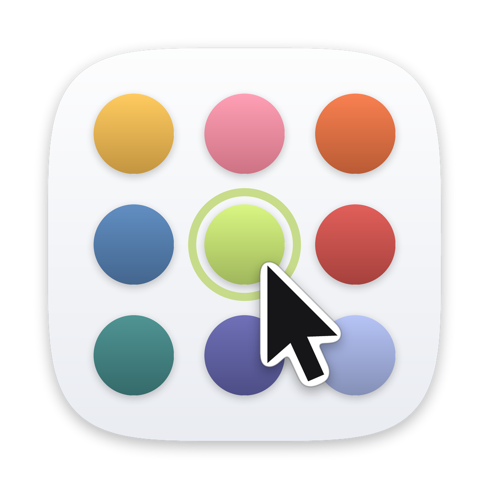

<p align="center">
  
</p>

<h1 align="center">macOS Accent Colors 🎨</h1>

<p align="center">
  Use the iMac and MacBook Neo accent colors on any Mac,<br>
  with a small app (<b>Accent Picker</b>) or two Terminal commands.
</p>

<p align="center">
  <a href="https://github.com/lucasaym/macos-accent-colors/releases/latest"><b>⬇︎ Download Accent Picker</b></a>
</p>

---

The colorful iMacs (2021 and 2024) and the MacBook Neo come with accent colors matched to their finish. Every recent copy of macOS contains them, but System Settings only offers them, as "This Mac", on those models. This repo explains how to unlock them on any Mac, and includes **Accent Picker**, an app that does it in one click, with a live preview.

- [Accent Picker, the app](#accent-picker-the-app)
- [Build from source](#build-from-source)
- [The manual method](#the-manual-method)
- [Color codes](#color-codes)
- [Undo everything](#undo-everything)
- [Credits](#credits)

## Accent Picker, the app

All the system and hardware accents in one window. Hover a color to preview it on a copy of the System Settings panel and on common controls; click it to apply.

**Requirements:** macOS 14 Sonoma or later, on any Mac (Apple silicon or Intel).

### Install

1. Download **Accent-Picker-x.x.x-macOS.zip** from the [latest release](https://github.com/lucasaym/macos-accent-colors/releases/latest).
2. Double-click the zip, then drag **Accent Picker** into your **Applications** folder.
3. Open it. macOS shows *"Accent Picker" Not Opened*: click **Done**.
4. Open **System Settings › Privacy & Security**, scroll down to *"Accent Picker" was blocked…*, and click **Open Anyway**. Confirm with your password or Touch ID.

That's only needed once. macOS asks because the app is free and not distributed through Apple, so Apple hasn't reviewed it. The full source code is in this repo.

<details>
<summary>For Terminal users</summary>

Instead of steps 3 and 4:

```bash
xattr -dr com.apple.quarantine "/Applications/Accent Picker.app"
```

</details>

### Using it

- **Click** a swatch to apply it. **Hover** a swatch to preview it without applying anything.
- Apps that are already open only switch to a hardware color after you quit and reopen them.
- If a hardware color doesn't appear, choose "This Mac" once in System Settings › Appearance.
- **Reset** removes the hardware settings and goes back to Multicolor.
- **How It Works…** (or Help › How It Works, ⌘?) explains all of this inside the app.

<details>
<summary>What the app changes</summary>

It writes these global preferences, the same as `defaults -g`:

| Choice | Keys |
| --- | --- |
| Multicolor | removes `AppleAccentColor` |
| System color | `AppleAccentColor` (−1 graphite, 0 red, 1 orange, 2 yellow, 3 green, 4 blue, 5 purple, 6 pink) |
| Hardware color | `NSColorSimulateHardwareAccent = YES`, `NSColorSimulatedHardwareEnclosureNumber = 3…17` |

The value System Settings stores for "This Mac" isn't documented. The app learns it the first time it launches while "This Mac" is selected, and reuses it afterwards.

</details>

## Build from source

Prefer to build the app yourself? You need the Xcode tools: run `xcode-select --install` once, then follow one of the two options below.

**With git**

```bash
git clone https://github.com/lucasaym/macos-accent-colors.git
cd macos-accent-colors && bash build.sh --install
```

**Without git:** download **Source code (zip)** from the [latest release](https://github.com/lucasaym/macos-accent-colors/releases/latest) and unzip it. In Terminal, type `cd ` (with a space), drag the unzipped folder onto the Terminal window, press Enter, then run:

```bash
bash build.sh --install
```

The script compiles the app, installs **Accent Picker** into Applications and opens it. It ends with *Done ✔ Installed in /Applications/Accent Picker.app*. An app you build yourself opens without the "Open Anyway" step.

> 💡 If the folder isn't in Downloads, Terminal may need permission to read it: System Settings › Privacy & Security › Files and Folders › Terminal.

| Command | Result |
| --- | --- |
| `bash build.sh` | builds `build/Accent Picker.app` without installing it |
| `bash build.sh --install` | builds it, installs it into Applications and opens it |
| `bash build.sh --release` | builds `build/Accent-Picker-x.x.x-macOS.zip`, the file attached to releases |

<details>
<summary>Publishing a new version (maintainer)</summary>

1. Change `VERSION` at the top of `build.sh` and commit.
2. Build the app zip and open its folder:

   ```bash
   bash build.sh --release && open build
   ```

3. On GitHub: **Releases › Draft a new release**, create the tag (`v1.0.0`), and drag `Accent-Picker-x.x.x-macOS.zip` into *Attach binaries*. GitHub adds the source code automatically.

</details>

## The manual method

To try one, run the enable command once, then set the desired number. For example, for green:

```bash
defaults write -g NSColorSimulateHardwareAccent -bool YES
defaults write -g NSColorSimulatedHardwareEnclosureNumber -int 4
```

Then open **System Settings › Appearance** and select the hardware-style option if it appears. Restarting the affected apps, or logging out and back in, may be necessary.

The original article says to restart apps or log out and back in; a later commenter reported that on Sonoma the color appeared in Appearance settings but was not automatically selected. That difference is plausible: the preference can make the option available without forcing every running app or the settings pane to refresh immediately.

## Color codes

### 1. The original iMac M1 colors

The original mapping, published by George Garside [here](https://georgegarside.com/blog/macos/imac-m1-accent-colours-any-mac/).

| Code | Color  | Display native values   | Hex |
| ---: | ------ | ----------------------- | --- |
|    3 | Yellow | 0,851 / 0,639 / 0,259   |  `#D9A342` |
|    4 | Green  | 0,239 / 0,399 / 0,416   |  `#3D666A` |
|    5 | Blue   | 0,273 / 0,384 / 0,481   |  `#46627B` |
|    6 | Pink   | 0,737 / 0,253 / 0,245   |  `#BC413E` |
|    7 | Purple | 0,286 / 0,301 / 0,473   |  `#494D79` |
|    8 | Orange | 0,690 / 0,354 / 0,218   |  `#B05A38` |

### 2. Later iMac colors: codes 9–14

Additional codes for the 2024 M4 iMac palette were later discovered. They're different shades from the 2021 ones; the values below are approximate until they're measured with Digital Color Meter.

| Code | Color  | Display native values   | Hex (≈) |
| ---: | ------ | ----------------------- | --- |
|    9 | Yellow | not measured yet        |  `#D6C463` |
|   10 | Green  | not measured yet        |  `#5A8054` |
|   11 | Blue   | not measured yet        |  `#546896` |
|   12 | Pink   | not measured yet        |  `#AB5757` |
|   13 | Purple | not measured yet        |  `#5D5B8B` |
|   14 | Orange | not measured yet        |  `#C4794D` |

### 3. MacBook Neo colors: codes 15–17

MacBook Neo introduced blush, indigo, silver, and citrus finishes, according to Apple. User testing indicated that the three non-silver colors map to:

| Code | Color  | Display native values   | Hex |
| ---: | ------ | ----------------------- | --- |
|   15 | Indigo | 0,608 / 0,657 / 0,835   |  `#9BA8D5` |
|   16 | Citrus | 0,735 / 0,835 / 0,423   |  `#BBD56C` |
|   17 | Blush  | 0,936 / 0,525 / 0,604   |  `#EF869A` |

### A combined reference table

| Code range | Reported device family | Reported colors                           |
| ---------- | ---------------------- | ----------------------------------------- |
| 3–8        | 2021 iMac M1           | Yellow, green, blue, pink, purple, orange |
| 9–14       | 2024 iMac M4           | Yellow, green, blue, pink, purple, orange |
| 15–17      | 2026 MacBook Neo       | Indigo, citrus, blush                     |

Apple doesn't document these numbers, so a macOS update could change them.

## Undo everything

Click **Reset** in Accent Picker, or run:

```bash
defaults delete -g NSColorSimulateHardwareAccent
defaults delete -g NSColorSimulatedHardwareEnclosureNumber
```

Then reopen System Settings and your apps, or log out and back in.

## Credits

- Made by **Lucas Aymard**.
- The trick was first described by George Garside: [Use iMac M1 accent colours on any Mac](https://georgegarside.com/blog/macos/imac-m1-accent-colours-any-mac/) (2021).
- Released under the [MIT License](LICENSE).
- iMac, MacBook and macOS are trademarks of Apple Inc. This project is not affiliated with Apple.
